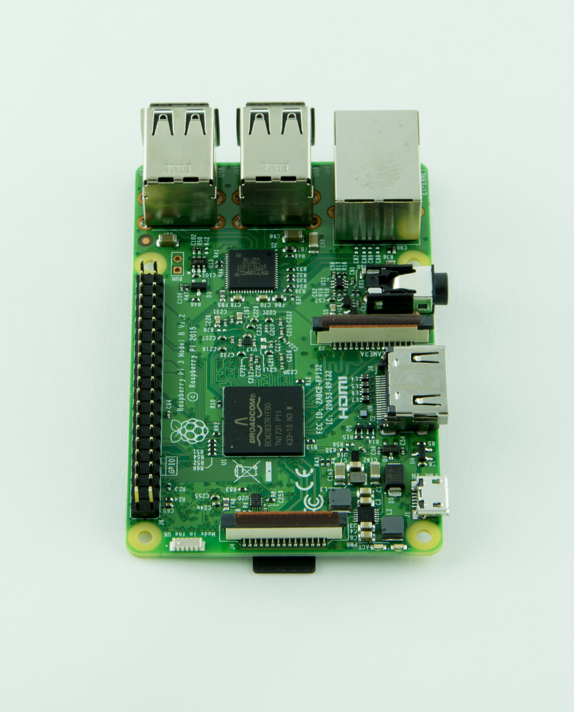
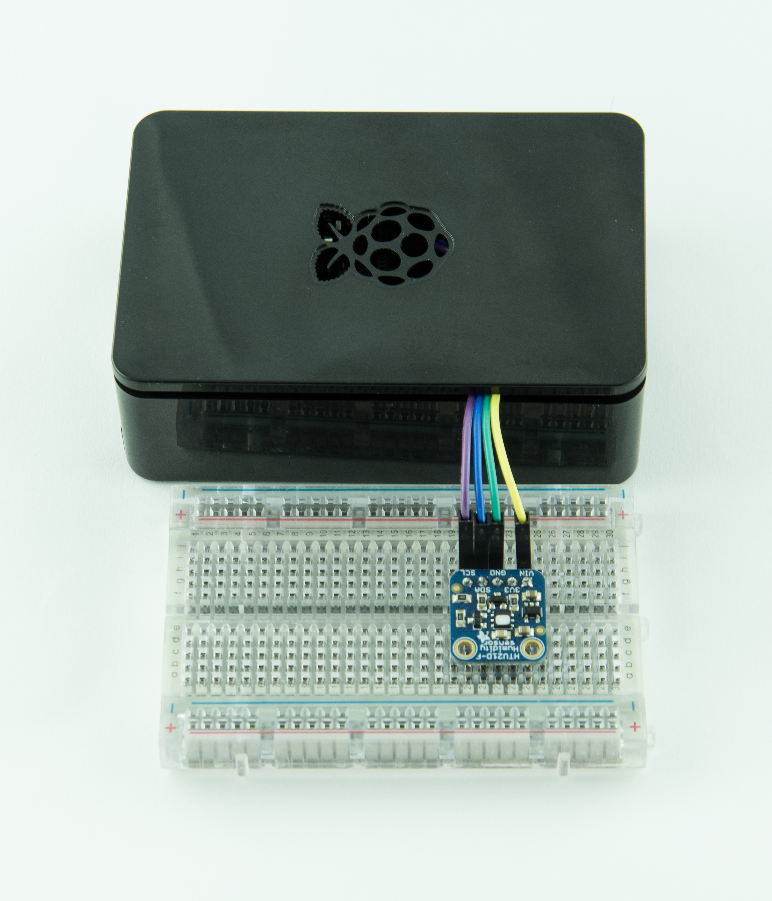

## 1. INTRODUCTION

The purpose of this document is to describe the steps needed to install and configure a TDM Edge Gateway, and to connect the measuring stations provided in the Design document.
The Edge Gateway is composed by a Single Board Computer Raspberry Pi 3 board and a microSD and some optional sensors physically connected to the board.
In the prototype a I2C temperature/humidity HTU21D has been used but it is quite simple to add other devices since the board specifications and sample sources are public.
The Edge Gateway communicates with the measuring stations and the cloud by means of a local WiFi.

 |
:------:|
| **Block diagram of the Edge Gateway** |

 |  |
------|-------|

Raspberry Pi 3 card with visible microSD on the underside (left picture) - Edge Gateway with a HTU21D sensord (right picture) |
--- |

