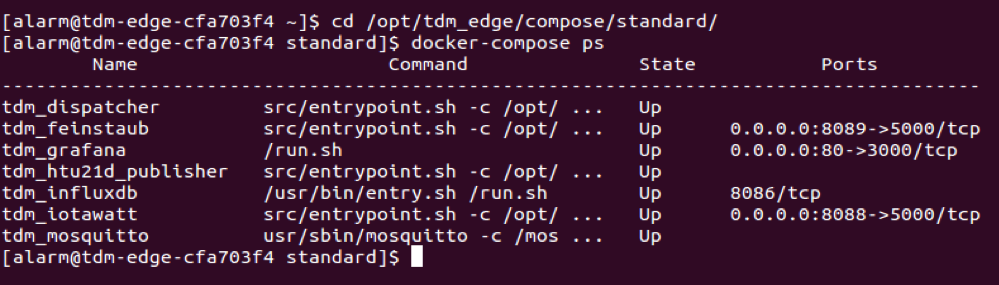
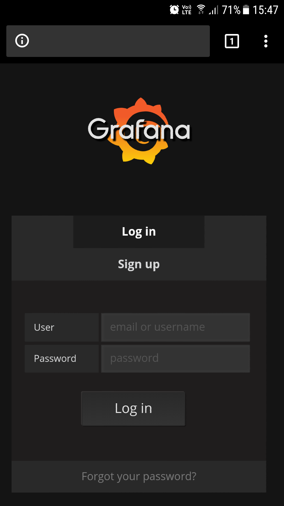
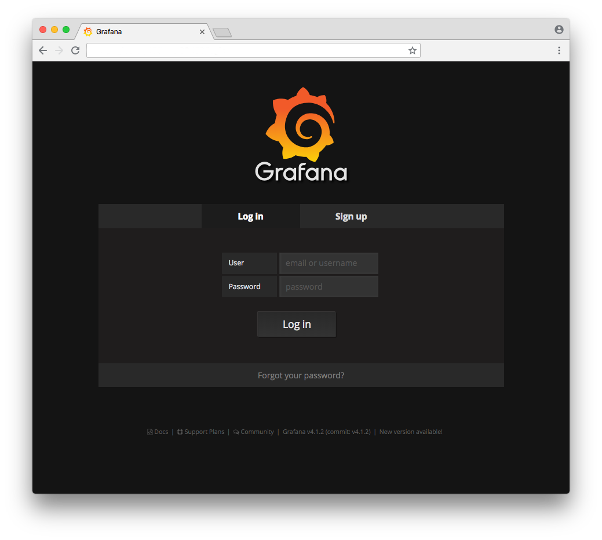

## 4. STARTUP OF THE SERVICES
To run in background all the Edge Gateway system services type the following commands:

```bash
cd /opt/tdm-edge/
docker-compose up -d
```

To check if services are running:

```bash
cd /opt/tdm-edge/
docker-compose ps
```

If no problem occurs the output should be like:



All the services should have the Up State.

### 4.1 ACCESS TO THE LOCAL DASHBOARD
If all the previous steps have been carried out correctly, it is possible to connect to the local dashboard 'Grafana' using a web browser:a’.

1. Open a browser in a PC connected to the same network of the Edge Gateway. 
2. Access to the IP address of the Edge Gateway (it can be retrieved from 'Local WiFi configuration on the Edge Gateway')
3. Use the following credential to login:

  ```
User: admin
Password: admin
  ```

4. It is now possible to configure Grafana to setup the dashboard and access the local InfluxDb. 

Official Grafana documentation with configuration instructions: <http://docs.grafana.org/>.

 |  |
--- | ---

Grafana access page: Smartphone (left) e PC (right) |
--- |

