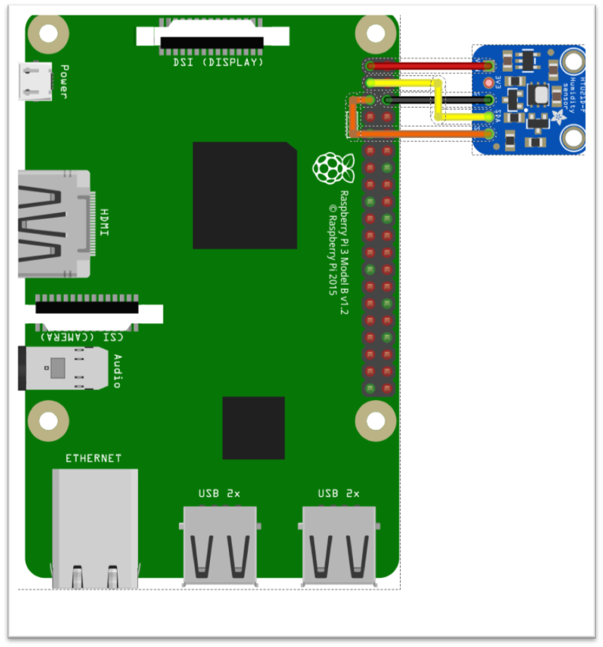
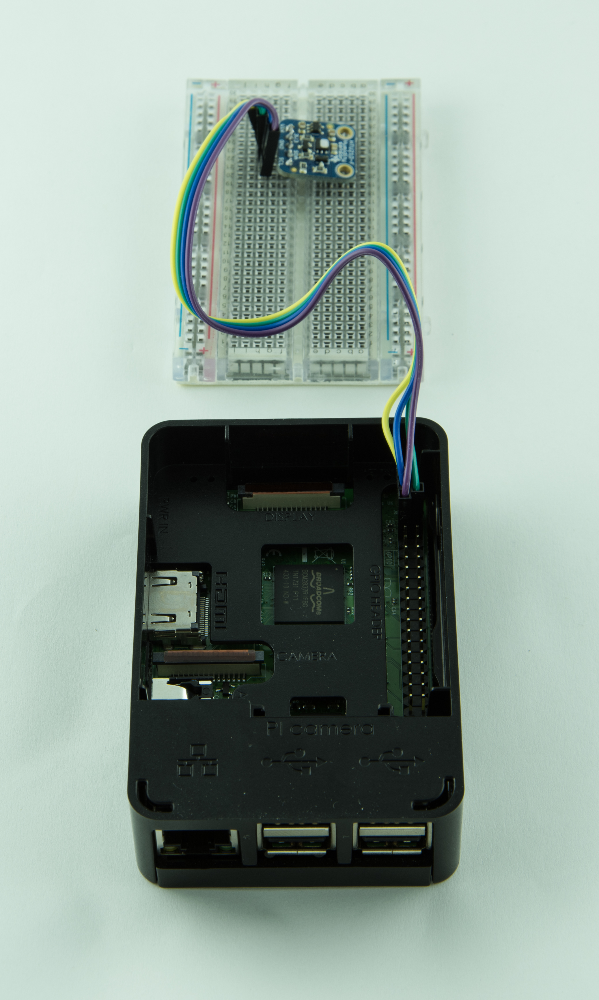

## 5. EXAMPLE OF WIRING BETWEEN RPI 3 AND AN INTEGRATED SENSOR

The Raspberry PI 3 module is expansible by using one or more senors directly connected to the platform. As an example, a temperature/humidity sensor like the HTU21D can be used with the I2C bus. The following figure shows the wiring details:

 |
--- |

Yellow and orange connections refers to the SDA and SCK signals respectively.

 |
:---: |

**Edge Gateway (Raspberry Pi 3) with HTU21D sensor conncted** |
