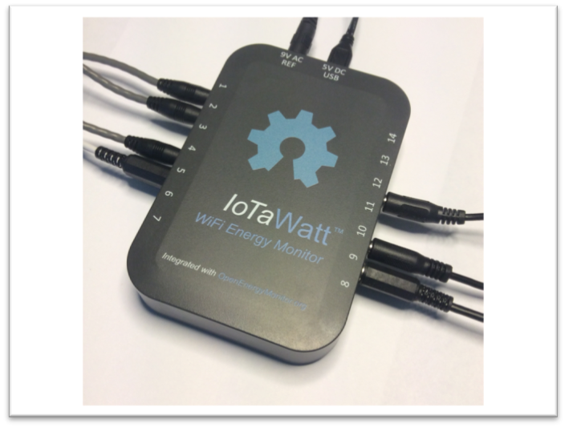

## 6. CONFIGURATION OF THE MEASURE STATIONS
To develop the prototype two measure stations have been connected to the Edge Gateway by using a local WiFi connection available on the installation site. In the following sections are described the instructions for the correct connection of the stations.

### 6.1 ENVIRONMENTAL AND WEATHER STATION 'STUTTGART FINE DUST SENSOR'

 |
:---: |
**SFDS Sation connected to the temperature/humidity and particulate sensor** |

To connect the SFDS station to the Edge Gateway both the WiFi exposed by the Edge Gateway and a local WiFi can be used along with the InfluxDB protocol. The configuration parameters are: 
 
```
Server InfluxDB: <Indirizzo_IP_domestico_dell'Edge>
Port InfluxDB: 8089
Username: user for logging to the DB (default 'root')
Password: password for logging to the DB (default 'root')
```

The local IP address of the Edge can be retrieved from the section ‘Local WiFi configuration of the Edge Gateway'.
If the Edge access point is used to connect the following setting must be used:

```
Server InfluxDB: 192.168.2.1
```

The user manual to build and configure the environmental/weather station is available at: <https://luftdaten.info/en/construction-manual/>.


### 6.2 ENERGY MONITORING STATION 'IOTAWATT'

### Beware of High Voltage

### This section describe a device that uses sensors close to high voltage circuits. The installation of the sensors should be done only by certified operators. 

### Not certified people that want to install the sensors, are aware that they do it at their own risk.

### The warnings in this guide are not intended to replace experience and training. Please pay attention to errors and consult a qualified technician for all procedures relating to mains voltage connections. For the configuration of the 'IotaWatt' station, refer to the official technical documentation.

 |
:---: |
**IotaWatt station with some connected sensors** |

To connect to the Edge Gateway use the following configuration lines:

```
Server InfluxDB: <Local_IP_address_of_Edge>
Port InfluxDB: 8088
Username: user for logging to the DB (default 'root')
Password: password for logging to the DB (default 'root')
```

The local IP address 


The local IP address of the Edge can be retrieved from the section ‘Local WiFi configuration of the Edge Gateway'.
If the Edge access point is used to connect the following setting must be used:

```
Server InfluxDB: 192.168.2.1
```

Official technical documentation of the Iotawatt station with installation instructions, configuration, schematics and source code: <https://guide.openenergymonitor.org/setup/iotawatt/>.
