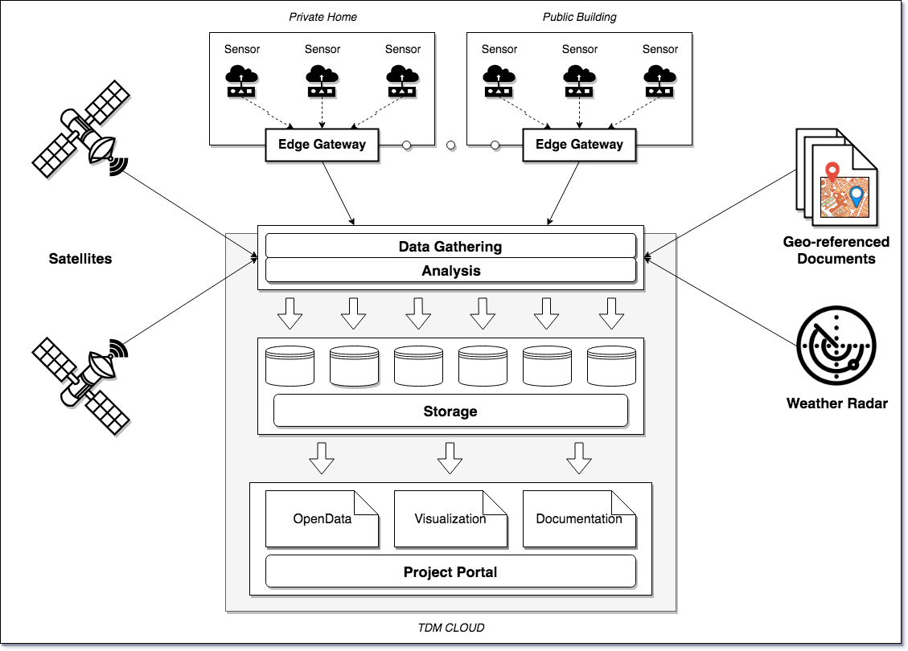

## OVERVIEW OF THE ACQUISITION AND AGGREGATION ARCHITECTURE

In recent years, the supply of services made available by cities to their
citizens has seen a rapid expansion thanks to the use, alongside traditional
information vehicles, of new digital tools. In addition, the quantity and the
the quality of information available has increased considerably, partly due to
the institutions continuous commitment to publish their *datasets* as
*OpenData* and partly to the production of new information, processed or
represented in other forms, starting from initial data. The very role of the
citizen is overturned. From a service user citizens becomes the source of the
information that these services use.

Topics such as environmental safety, energy and historical/cultural heritage
awareness always increasingly involve the citizen as an *information consumer*,
but above all as an *information provider*. The data then becomes extremely
ubiquitous, produced in different ways, with different resolutions and
qualities. These new sources are then combined with traditional ones, which are
usually more precise and standard but more expensive and less flexible. To
create new services, it is therefore necessary to put together new types of
information with traditional ones, new channels with the classics.

Among the activities of any scalable data acquisition system there is,
therefore, the use of low cost hardware platforms to be distributed throughout
the territory. In the TDM project, in particular, we will use these sensors to
monitoring meteorological-environmental parameters and energy consumption.

The acquisition method for these data must be calibrated to their specific type
and on the instruments that generate it. In particular, measurements from the
sensors can be acquired from devices of different types and distributed over a
large area. Therefore it arises the problem of how effectively transmit the
amount of data generated in a *standard* message-format for collection and
storage.

It is therefore necessary to place a device for collection and forwarding of
the data between on-the-field sensors and the *acquisition cloud*. This device
decouples the acquisition of the measurement from the sending and copes with
the limits of the sensors themselves. Limited capacity of the network,
congestion, disruptions, reduced computational and storage resources,
inadequate or absent security in communications, no network devices are some of
the technological problems encountered using, for example, economic sensors
that are easily accessible to ordinary citizens. These problems must be taken
into account in the design phase of a system intended to be used also with data
and fields other than the ones imagined. Within the TDM project, this local
collection and forwarding component is called *Edge Gateway*.

The integration of the data coming from an Edge Gateway within a scalable
aggregation architecture, processing and return is exemplified in the following
figure, which shows the different components of the TDM project.

The central collection of data from the Edge Gateways, as well as other sources
such as satellite images, weather radars, maps and other georeferenced static
data takes place in the *TDM cloud* using a *Lambda Architecture*. As soon as
they arrive, the data is pre-processed into what is called *stream processing*,
and which responds to *real-time* needs given by data updates. At the same
time, the data received, along with the pre-processed data, are saved in
*BigData storage* systems where they remain available for further processing.
Part of these then feed longer elaborations which require more data and less
timely results, the so-called *batch processing*. Batch processing includes,
for example, short-term weather forecasting (*nowcasting*), analysis of energy
consumption history, the creation of models for visualization. As for all the
other data, also the results of batch processing are stored. Data, then, can be
returned through visualization components integrated in an *integrated project
portal*.

The Edge Gateway described here is of general use, and has been specifically
designed to be used with FIWARE-based infrastructures other than TDM and with
other IoT clouds. In particular, by inserting a standardized Edge Gateway, with
local processing and storage capabilities, between the sensors and the cloud,
is possible to achieve significant advantages, including the possibility of a
local aggregation of signals from multiple sensors and transimission to the
data collection and analysis infrastructure. In addition, ensuring the presence
in local aggregators of enough computing and storage power, to these tasks is
added also that of a first storage and data processing and filtering. This
capacity, therefore, allows to reduce the amount of data transferred and the
transmission rate, as well as to provide to the connected devices with a
real-time response, required for controlling applications and not only
monitoring. In addition, it is also possible to manage an initial access to the
data without any network connection, which allows different levels of access
and privacy control.
