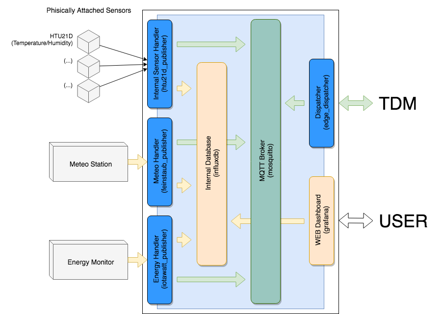
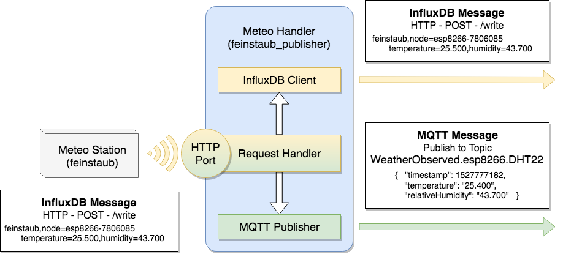
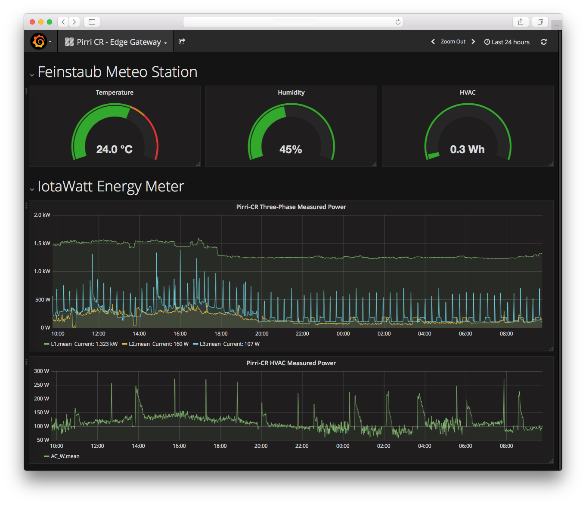

## 4. LA PIATTAFORMA SOFTWARE DELL’EDGE GATEWAY
### 4.1 ARCHITETTURA GENERALE

L’Edge Gateway ha il compito di interfacciarsi con i sensori locali o stazioni
remote di misura presenti nell’edificio in cui è installato. Sebbene in via
prototipale si sia identificato un set di questi da usare per sviluppo e test,
lo scopo dell’Edge Gateway è quello di permettere una integrazione trasparente
di nuovi sensori, tipi di dato, metodiche di interfacciamento. Il suo software
deve perciò permettere una elevata flessibilità e al tempo stesso una buona
resilienza ad errori e problemi indotti da nuove componenti.

L’architettura software scelta per la realizzazione dell’Edge Gateway è
definita ‘*Choreography of loosely-coupled, containerized microservices*’, ossia
è una composizione di microservizi non strettamente accoppiati distribuiti in
application container. Il cuore dell’architettura è quindi costituita da una
rete di microservizi collegati tra loro in maniera tale che la non
disponibilità di uno o più di essi non infici il funzionamento dei restanti e
del sistema nel suo insieme.

Una implementazione completa di riferimento è stata realizzata nel quadro del
progetto TDM ed è resa disponibile su ***GITHUB*** all’indirizzo:
<https://github.com/tdm-project>.

Schema a Blocchi dell'Edge Gateway                           |
-------------------------------------------------------------|
 |

### 4.2 I MICROSERVIZI
In un’applicazione monolitica, tutte le funzionalità sono implementate in una
singola unità eseguibile. Tutte le componenti interne condividono risorse quali
ad esempio lo stesso spazio di memoria e gli stessi file handler, e un bug in
uno dei moduli o dei thread può risultare nella corruzione delle risorse usate
dal resto dell’applicazione, ossia nella propagazione del bug. L’aggiornamento
e il bug-fixing inoltre deve essere sviluppato, testato e rilasciato per tutto
l’applicativo, complicando tutte le fasi e introducendo nuovi punti rottura.
Alla stessa maniera l’aggiunta di nuove funzionalità comporta una revisione di
tutta l’applicazione e la sua sostituzione, con tempi e costi non facilmente
determinabili a priori.

In un’applicazione basata su microservizi, invece, le varie funzionalità sono
separate ed assegnate ad applicazioni più piccole e dedicate a fornire solo
quella funzionalità specifica. Questo porta diversi vantaggi:

* definiti i compiti e le interfacce di comunicazione, i vari microservizi
  possono essere sviluppati contemporaneamente e indipendentemente, rilasciati
in momenti differenti e mantenuti separatamente;
* la riduzione delle dimensioni del singolo micro-servizio permette una più
  agevole revisione del codice diminuendo le possibilità di introduzione di bug
e facilitando la loro identificazione;
* l’applicazione complessiva risulta più resiliente, riducendo la possibilità
  di single point-of-failure e la propagazione di guasti o interruzioni da un
modulo agli altri;
* aggiornare o aggiungere nuovi moduli non richiede la sostituzione o lo
  spegnimento degli altri.

### 4.3 GLI APPLICATION CONTAINER
L’architettura software dell’Edge Gateway prevede la distribuzione dei
microservizi attraverso application *‘container’*. I container possono essere
considerati dei pacchetti software contenenti l’applicazione principale che
devono eseguire e tutte e sole le librerie e i file richiesta da questa. A
differenza di una macchina virtuale, alla quale possono essere paragonati, non
richiedono un sistema operativo completo e un kernel proprio in esecuzione, ma
utilizzano le funzionalità del kernel in esecuzione nel sistema ospitante. A
differenza di una macchina virtuale inoltre condividono le stesse risorse messe
a disposizione dal sistema ospitante quali spazio disco, memoria e rete,
evitando limitazioni e frammentazioni inutili e mantenendo al contempo la
separazione dei processi in esecuzione e l’accesso esclusivo a alle risorse
utilizzate.

I vantaggi di usare la containerizzazione per l’esecuzione dei microservizi
diventa evidente però considerando l’aspetto della distribuzione. Applicazioni
differenti possono richiedere, per la stessa libreria, versioni differenti. In
un ambiente condiviso quale ad esempio il sistema operativo ospitante, ciò
potrebbe portare ad una rottura della catena delle dipendenze: l’adozione di
una versione impedisce l’esecuzione delle altre. Tale problema, seppur non
presente inizialmente, può presentarsi successivamente nella vita di un
prodotto nel momento in cui è necessario un aggiornamento: l’aggiornamento di
una libreria richiesta da un micro-servizio può danneggiare un altro
micro-servizio che non necessitava. Questo problema viene evitato con la
distribuzione di una application assieme alle proprie copie di librerie in un
ambiente dedicato e isolato. Altro problema del quale la containerizzazione
rappresenta una soluzione è la riproducibilità. Il container è distribuito con
l’applicazione, file e librerie con i quali è stato sviluppato e testato. Se
l’applicazione funziona nel container quando viene rilasciata, dato che
l’ambiente operativo ospitante non influenza il funzionamento del container,
questa funzionerà una volta distribuita.

La tecnologia utilizzata per la containerizzazione dei microservizi nell’Edge
Gateway è la piattaforma Docker. Gli strumenti messi a disposizione da Docker
permettono la creazione, l’aggiornamento, il *versioning* e l’esecuzione di
container per microservizi. In particolare, uno strumento, *docker-compose*,
permette l’avvio e la composizione di diversi microservizi configurando aspetti
come i collegamenti, lo storage e l’accesso a specifiche periferiche hardware
del sottostante sistema ospitante, attraverso un unico file di configurazione.

### 4.4 COMUNICAZIONI INTERNE ED ESTERNE
I microservizi, contenuti nei container
Docker e in esecuzione, necessitano di comunicare tra di loro per poter
svolgere le funzioni assegnate all’Edge Gateway. Per evitare che la
comunicazione interna possa rappresentare un vincolo per la flessibilità e
l’affidabilità del sistema con latenze elevate, carico, timeout e propagazione
di errori in presenza di problemi ad un solo dei componenti, si è adottato il
paradigma di comunicazione asincrono Publish/Subscribe con boker. Nel
Publish/Subscribe il mittente di un messaggio, il *publisher* invia il proprio
messaggio ad un tramite centrale detto *broker* senza necessità di specificare
il destinatario ma solo il *topic*, una sorta di mailbox. I destinatari del
messaggio, o meglio i consumatori, detti *subscriber* a loro volta si
sottoscrivono presso il broker ad uno specifico topic, una sorta di
abbonamento, per ricevere i messaggi inviati al relativo topic. Così come il
publisher, anche il dispatcher non conosce il mittente del messaggio. Più
publisher possono pubblicare sullo stesso topic, e più subscriber
sottoscriversi allo stesso topic. O alternativamente, un subscriber può
ricevere messaggi da più publisher e uno stesso messaggio può essere recapitato
a più subscriber.

Esistono diversi protocolli e framework per che implementano il paradigma
Publish/Subscribe con broker. Per l’Edge Gateway si è adottato il protocollo
standard MQTT: oltre ad essere uno dei protocolli maggiormente usati
nell’Internet of Things, è estremamente leggero, flessibile e ha
implementazioni in diversi linguaggi di programmazione e per diverse
architetture. In particolare la sua flessibilità risiede nel fatto, tra le
altre cose, di essere agnostico per quanto riguarda il contenuto del messaggio,
occupandosi solo della sua trasmissione e ricezione.

Internamente quindi i microservizi produttori di dati quali gli handler dei
sensori e delle stazioni pubblicano i propri messaggi su topic distinti in base
al dominio di appartenenza, meteo, ambientale, energetico. I microservizi
consumatori di tali messaggi, come il dispatcher, invece sottoscrivono su quei
topic in attesa di messaggi. La comunicazione asincrona evita quindi ai
microservizi di tenere costantemente un canale aperto tra di loro in attesa di
dati o di conferme di ricezione. Inoltre, l’aggiunta di un nuovo publisher o di
un nuovo subscriber è del tutto trasparente al sistema, in quanto non è
necessario creare nuovi instradamenti o assegnare indirizzi o porte.

Per quanto riguarda la trasmissione verso l’esterno, vale lo stesso discorso.
L’adozione del protocollo MQTT per le comunicazioni dall’Edge Gateway verso il
sistema di raccolta centrale, oltre ai già citati vantaggi, offre la
possibilità di autenticare e crittografare i messaggi attraverso SSL/TLS, una
migliore efficienza della rete in ingresso al cloud e la scalabilità del
servizio.

### 4.5 I MICROSERVIZI DELL’EDGE GATEWAY
L’Edge Gateway è costituito da tre categorie di microservizi:

* i ‘*sensor handler*’ e ‘*station handler*’ o semplicemente gli ‘*handler*’;
* il ‘*dispatcher*’;
* e gli ‘*ancillary service*’.

#### 4.5.1 GLI HANDLER
Gli handler sono i microservizi incaricati di gestire i sensori collegati
fisicamente all’Edge Gateway e i sensori singoli remoti (‘*sensor handler*’) o
le comunicazioni con le stazioni di misura remote costituite da più sensori
(‘*station handler*’). In particolare i loro compiti sono, nel caso di un
sensor handler

* configurare il canale o bus di comunicazione e inizializzare il sensore;
* interrogare periodicamente il sensore per avere le misure delle grandezze di
  interesse;
* inviare al broker locale il pacchetto di dati acquisiti.

Per quanto riguarda lo station handler (meteo, energia etc…), i compiti sono:

* instaurare il collegamento con la stazione remota o aprire un socket di rete
  di ascolto;
* ricevere i dati inviati dalle stazioni;
* inserire i dati nel database locale;
* convertire e inviare al broker locale il pacchetto di dati acquisiti.

Gli handler sono scritti in Python versione 3 e hanno una struttura del codice
pressoché simile:

* possono essere configurati sia tramite file di configurazione che tramite
  opzioni a riga di comando;
* usano lo stesso tipo di file di configurazioni con campi comuni e campi
  specifici;
* tutti gli handler possono usare un unico file diviso in sezioni, ognuna col
  nome dell’handler che configura.

#### Meteo Handler
L’handler della stazione meteo remota prende il nome di Feinstaub Publisher dal
nome della stazione meteo e qualità dell’aria adottata. Dato che tale stazione
invia i propri dati tramite WiFi in formato e con protocollo atto
all’inserimento in un database InfluxDB, il relativo handler simula una server
InfluxDB in ascolto e intercetta i dati in arrivo. Questi dati sono quindi
inseriti nel database locale InfluxDB per una successiva consultazione da parte
degli altri microservizi e allo stesso tempo convertiti in un messaggio
standard che viene inviato al broker MQTT locale per la gestione di eventi o
l’inoltro verso l’esterno.

#### Energy Handler
L’handler della stazione remota di misura dell’energia prende il nome di
Iotawatt Publisher dal nome del tipo di stazione adottata. Dato che anche tale
stazione invia i propri dati tramite WiFi per l’inserimento in un database
InfluxDB, il relativo handler è molto simile all’handler meteo di cui ne mutua
gran parte del codice. Simula anch’essa un server InfluxDB in ascolto, ne
riceve i dati, li inserisce nel database locale InfluxDB e li convertite in un
messaggio standard che viene inviato al broker MQTT locale.

#### Internal Sensors Handler
L’Edge Gateway può avere dei sensori direttamente collegati ai propri
connettori. In base al tipo di interfaccia o bus alla quale sono collegati, un
micro-servizio diverso si occupa di instaurare il collegamento, configurare i
sensori presenti sul quella interfaccia e interrogarli periodicamente. Per
quanto riguarda il sensore usato in questo reference design, il sensore di
temperatura e umidità HTU21D, l’handler prende il nome di HTU21D Publisher.
Questo handler apre l’interfaccia sul bus I2C sul quale opera il sensore e ad
intervallo di tempo prestabiliti nel file di configurazione o a riga di comando
interroga il sensore e invia al broker MQTT locale il messaggio coi parametri
rilevati, in questo caso temperatura, umidità e il punto di rugiada calcolato
partendo dai primi due.

Esempio di flusso dati all’interno di un handler                                  |
----------------------------------------------------------------------------------|
 |

#### 4.5.2 IL DISPATCHER
Il *dispatcher* è un micro-servizio in ascolto sul broker locale, o *subscriber
MQTT*, che riceve i messaggi inviati dagli handler. Il dispatcher ha il compito
principale di inoltrare i dati acquisiti verso il sistema remoto di raccolta ed
elaborazione. Esso risponde a due necessità principali:

* i sensori e le stazioni possono generare localmente quantità di dati e a
  frequenza tale da non poter essere inviati direttamente e in tempo reale al
cloud remoto, pena la congestione e il sovraccarico sia della rete esterna, sia
dei sistemi remoti; occorre quindi disciplinare l’invio in base alla capacità
della rete e alla quantità di dati da inviare;
* per garantire la sicurezza e la confidenzialità della trasmissione al sistema
  remoto di raccolta attraverso Internet dei dati, è necessario autenticare e
cifrare la comunicazione attraverso credenziali di accesso quali nome utente e
password e certificati digitali; per maggior sicurezza, è preferibile che solo
un micro-servizio abbia accesso e possa usare queste credenziali per
presentarsi al broker remoto.

Il dispatcher svolge quindi il compito di:

* disaccoppiare la produzione dei dati dal loro invio al fine di poterli
  conservare temporaneamente, comprimerli e inviarli ad intervalli
configurabili in base alle capacità della rete;
* presentare al cloud remoto le credenziali per l’accesso e l’invio;
* gestire localmente eventuali interruzioni delle comunicazioni o
  deterioramenti delle stesse.

#### 4.5.3 I SERVIZI AUSILIARI
I servizi ausiliari sono microservizi che implementano delle funzionalità
condivise cioè non proprie degli altri microservizi ma da questi utilizzate.
Questi servizi ausiliari sono:

* il broker MQTT locale;
* il database locale;
* la dashboard locale.

#### Il broker MQTT locale
Il broker MQTT locale implementa il bus di comunicazione asincrono per i vari
microservizi. In esso i *producer* di dati, gli handler, pubblicano i propri
dati su appositi topic, ad esso i *consumer* di dati, il dispatcher ed altri
eventuali microservizi di gestione di eventi, sottoscrivono la notifica e
l’inoltro dei dati pubblicati. Il software usato per fornire il servizio di
broker MQTT si chiama ‘*mosquitto*’. E’ stato scelto in quanto è tra i più
leggeri in termini di risorse richieste, implementa tutte le specifiche del
protocolle MQTT, sebbene il suo uso interno non richieda particolari necessità,
e si è dimostrato il più adatto a venire utilizzato in un ambiente con risorse
limitate.

#### Il Database Locale
Il database locale ha il compito di immagazzinare i dati provenienti da sensori
e stazioni di misura remote per la successiva visualizzazione da parte
dell’utente, dell’interfaccia grafica locale, o da ulteriori microservizi di
preprocessing.  Il database utilizzato è ***InfluxDB*** ed è stato scelto in quanto
database di destinazione generalmente utilizzato dalle stazioni di misurazione
remote meteo e energetica.

#### La Dashboard Locale
La dashboard locale è il software che permette all’utente di visualizzare i
dati raccolti e immagazzinati dal suo Edge Gateway. Il software utilizzato in
questo caso è ***Grafana***, un tool di visualizzazione web estremamente diffuso ed
utilizzato per la visualizzazione e la creazione di grafici e cruscotti basati
su serie storiche di dati. Grafana permette infatti all’utente, attraverso
l’accesso da browser web, non solo di visualizzare i propri dati, ma anche di
creare da se grafici e indicatori basati su l’elaborazione di questi.

Esempio di Dashboard Grafana su Edge Gateway                                  |
------------------------------------------------------------------------------|
 |

#### 4.5.4 I MODELLI DI DATI
Il design dell’Edge Gateway prevede l’utilizzo di sensori e stazioni di misura di produttori e modelli diversi. Questi
possono differire, dal punto di vista della trasmissione dei dati, sia nel protocollo usato, che nel formato dei dati stessi.
Affinché dati dello stesso tipo ma prodotti da oggetti diversi e in formato diverso possano essere raccolti ed utilizzati
dal progetto TDM, è necessaria una conversione in un formato comune e predefinito. In quanto nel progetto TDM si è
scelto di aderire alle linee guida della iniziativa ***OASC*** e della sua piattaforma tecnologica di riferimento, l’ecosistema ***FIWARE***, dove possibile e dove già definiti, si è scelto di usare i Modelli di Dato Armonizzato (Harmonized Data
Models) di FIWARE. Per i domini dei sensori per i quali non è presente un Data Model Armonizzato FIWARE o non è
stato possibile identificarne uno adeguato tra quelli presenti, si è deciso di definirne di nuovi sul modello di quelli
esistenti.

#### Il messaggio di tipo ‘Meteo’ - WeatherObserved
Per le stazioni meteo si è scelto di usare il modello di dato armonizzato
‘WeatherObserved’
(https://fiwaredatamodels.readthedocs.io/en/latest/Weather/WeatherObserved/doc/spec/index.html).
Tuttavia, dato che parte dei sensori presenti nella stazione meteo inizialmente
utilizzata riguardano anche misure della qualità dell’aria, e che il relativo
modello non appariva sufficiente, si è esteso il ‘WeatherObserved’ aggiungendo
i campi necessari.

Il modello dati ‘WeatherObserved’ è messaggio di tipo ‘JSON’ con campi
obbligatori e campi opzionali. Il messaggio contenente i campi obbligatori ma
in difetto di alcuni campi opzionali è comunque ritenuto valido. E’ questo il
caso di stazioni meteo che non posseggono tutti sensori richiesti. Non tutti i
campi previsti nel modello sono però presenti nel messaggio. Alcuni di questi
infatti vengono popolati e utilizzati dai componenti della piattaforma FIWARE
nel cloud TDM durante l’elaborazione.

I campi obbligatori sono:

* **id**: identificativo univoco della stazione;
* **type**: tipo del messaggio, deve essere ‘**WeatherObserved**’;
* **location**: posizione della stazione meteo (GeoJSON) obbligatorio se
  address non è presente;
* **address**: indirizzo civico della stazione;
* **dateObserved**: data e ore dell’osservazione (ISO8601 UTC).

I campi opzionali usati sono:

* **temperature**: temperatura dell’aria (numerico, gradi Celsius);
* **relativeHumidity**: umidità relativa dell’aria (numerico, percentuale);
* **precipitation**: quantità di pioggia (numerico, mm);
* **windDirection**: direzione del vento (numerico, gradi decimali Nord);
* **windSpeed**: velocità del vento (numeric m/s);
* **atmosphericPressure**: pressione atmosferica (numerico, hPa);
* **illuminance**: illuminazione (numerico, lux o lumen/mq).

Campi opzionali aggiunti:

* **timestamp**: timestamp della creazione del messaggio (numerico, UNIX
  Epoch);
* **infraredLight**: luce infrarossa (numerico, misura relativa al sensore);
* **CO**: quantità di CO (numerico, misura relativa al sensore);
* **NO**: quantità di NO (numerico, misura relativa al sensore);
* **NO2**: quantità di NO2 (numerico, misura relativa al sensore);
* **NOx**: quantità di NOx (numerico, misura relativa al sensore);
* **SO2**: quantità di SO2 (numerico, misura relativa al sensore);
* **PM10**: quantità di polveri PM 10 (numerico, misura relativa al sensore);
* **PM2.5**: quantità di polveri PM 2.5 (numerico, misura relativa al sensore).

Dato che il campo **dateObserved** può essere modificato dai componenti della
piattaforma FIWARE, questo non viene inviato dagli EDGE ma è stato aggiunto il
campo timestamp per comunicare il **timestamp** del rilevamento da parte dei
sensori.

Esempio del messaggio FIWARE ‘WeatherObserved’ usato. |
------------------------------------------------------|
```json
{
    "id": "Cagliari-Pirri-ExDistilleria",
    "type": "WeatherObserved",
    "dateObserved": "2016-11-30T07:00:00.00Z",
    "location":
     {
        "type": "Point",
        "coordinates":
        [ -4.754444444, 41.640833333 ]
    },
    "temperature": 3.3,
    "relativeHumidity": 1,
    "atmosphericPressure": 938.9,
    "windDirection": -45,
    "windSpeed": 2,
    "precipitation": 0,
    "illuminance": 1000,
    "infraredLight": 850,
    "CO": 500,
    "NO": 45,
    "NO2": 69,
    "NOx": 139,
    "SO2": 11,
    "PM10": 11,
    "PM2.5": 11,
}
```

#### Il messaggio di tipo ‘Energia’ - EnergyMonitor
Per le stazioni di monitoraggio energetico non è stato identificato un data
model adeguato e si è provveduto a crearne uno ad-hoc che possa essere ampliato
e sottoposto alla comunità FIWARE per un eventuale discussione e adozione.
Come per il messaggio ‘WeatherObserved’, anche il messaggio ‘EnergyMonitor’ è
in formato ‘JSON’ con campi obbligatori e campi opzionali, e un messaggio
‘EnergyMonitor’ contente campi obbligatori ma in difetto di alcuni campi
opzionali è comunque ritenuto valido.

I campi obbligatori sono:

* **id**: identificativo univoco della stazione;
* **type**: tipo del messaggio, deve essere ‘**EnergyMonitor**’;
* **location**: posizione della stazione meteo (GeoJSON) obbligatorio se
  address non è presente;
* **address**: indirizzo civico della stazione;
* **dateObserved**: data e ore dell’osservazione (ISO8601 UTC).

I campi opzionali usati sono:

* **timestamp**: timestamp della creazione del messaggio (numerico, UNIX
  Epoch);
* **voltage**: tensione della linea elettrica (numerico, Volt);
* **current**: corrente che attraversa la linea elettrica (numerico, Ampere);
* **apparentPower**: potenza apparente assorbita dal carico (numerico,
  Volt-Ampere);
* **realPower**: potenza reale assorbita dal carico (numerico, Watt);
* **powerFactor**: fattore di potenza (numerico, tra 0 e 1);
* **consumedEnergy**: energia consumata (numerico, Wh);
* **frequency**: frequenza della linea eletrica (numerico, Hz).

Dato che il campo **dateObserved** può essere modificato dai componenti della
piattaforma FIWARE, questo non viene inviato dagli EDGE ma è stato aggiunto il
campo **timestamp** per comunicare il timestamp del rilevamento da parte dei
sensori.

Esempio del messaggio NGSIv1 ‘EnergyMonitor’ usato. |
----------------------------------------------------|
```json
{
    "id": "Cagliari-Pirri-ExDistilleria",
    "type": "EnergyMonitor",
    "dateObserved": "2016-11-30T07:00:00.00Z",
    "location":
    {
        "type": "Point",
        "coordinates":
        [-4.754444444, 41.640833333]
    },
    "voltage": 235.90,
    "current": 3.74,
    "apparentPower": 882.9,
    "realPower": 250.8,
    "powerFactor": 0.66
}
```

### 4.6 I TOPIC
Per poter inoltrare correttamente e secondo eventuali policy di trasmissione i
messaggi, questi devono essere pubblicati internamente in specifici topic MQTT.
Questi in generale hanno la forma:

***TipoDelMessaggio/IdentificativoStazione.ModelloDelSensore***

#### 4.6.1 I TOPIC PER ‘METEO’
I topic per i messaggi meteo iniziano con ‘*WeatherObserved*’. Ad esempio, per
una stazione di tipo *feinstaub* i messaggi relativi a temperatura e umidità
misurati dal sensore DHT22 saranno pubblicati sul topic:

***WeatherObserved/esp8266-XXXX.DHT22***

#### 4.6.2 I TOPIC PER ‘ENERGIA’
I topic per i messaggi di tipo energetico iniziano con ‘*EnergyMonitor*’. Ad
esempio, per una stazione di tipo *IotaWatt* i messaggi relativi a corrente,
voltaggio, e altri parametri misurati sulla linea di un condizionatore, *HVAC*,
saranno pubblicati sul topic:

***EnergyMonitor/IOTAWATT.HVAC***

