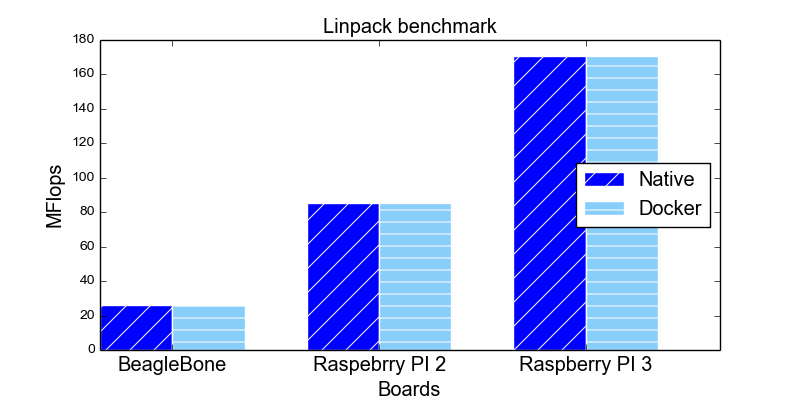
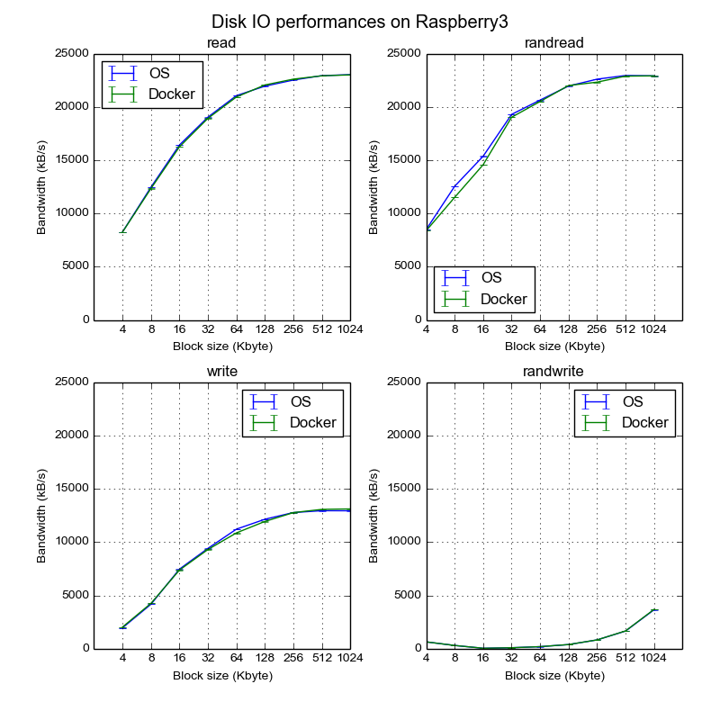
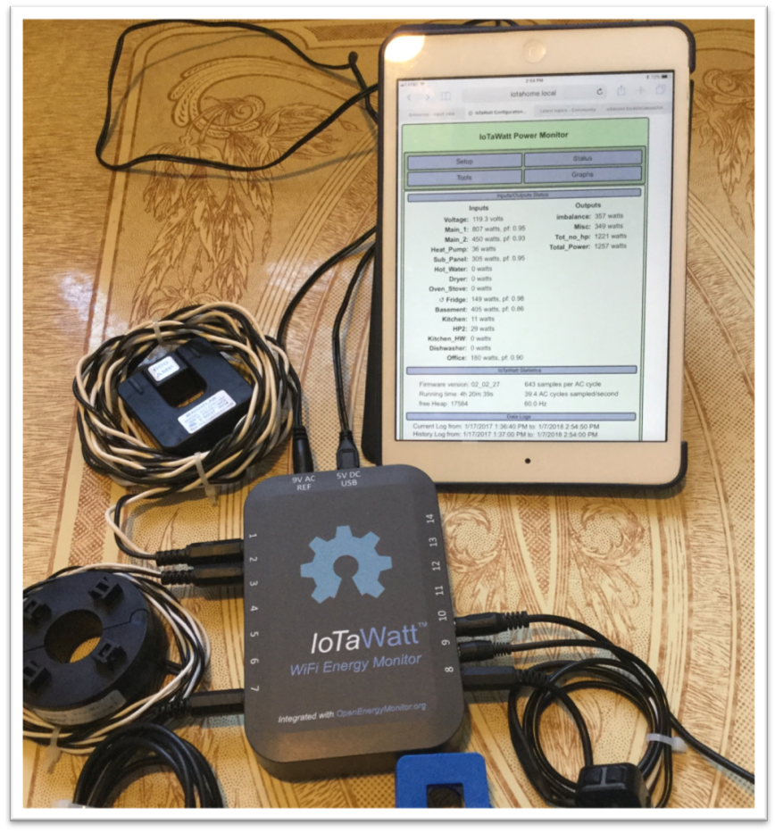

## 5. LA PIATTAFORMA HARDWARE DELL’EDGE GATEWAY
### 5.1 SOLUZIONI HARDWARE CONSIDERATE
Tre Single Board Computer sono state prese in considerazione come piattaforme
hardware embedded per il prototipo dell’Edge Gateway: la scheda BeagleBone
Black e le schede Raspberry PI versione 2-B e 3-B. Queste tre rispondono ai
requisiti iniziali di costo ridotto e reperibilità sul mercato, essendo
acquistabili facilmente su e-commerce con costi tra i 30 e gli 80 euro, e
possiedono un’ampia comunità di sviluppatori e utenti. Innumerevoli forum,
portali dedicati e blog inoltre forniscono documentazione, assistenza ed esempi
di applicazioni che ne fanno piattaforme ideali per scopi didattici.

#### 5.1.1 BEAGLEBONE BLACK
La BeagleBone Black è un single-board computer prodotta da Texas Instruments
assieme a Digi-Key and Newark Element14. Utilizza una CPU ARM Cortex-A8 a 32
bit, frequenza massima di 1GHz con 512 MB di RAM DDR3. Il processore ha un
singolo core ma dispone di due unità embedded Real-Time programmabili. Lo
storage è rappresentato da una memoria da 4GB onboard e un lettore per microSD
card. Possiede un ampio set di periferiche a basso livello come UART, CAN,
I2C/SPI, ADC, USB. 

La connettività di rete è fornita da una scheda di rete ethernet integrata a
100 Mbit/s. Non possiede connettività wireless, che può tuttavia essere fornita
attraverso un dispositivo esterno USB. L’assorbimento di corrente stimato è di
210-460 mA con alimentazione a 5V.

#### 5.1.2 RASPBERRY PI 2
Le Raspberry Pi sono una serie di SBC sviluppate nel Regno Unito dalla
Raspberry Pi Foundation al fine di fornire una piattaforma per l’insegnamento
dei principi dell’informatica e della programmazione nelle scuole e nei paesi
in via di sviluppo. La Raspberry PI 2 utilizza un System-on-Chip Broadcom
basato sul processore ARM Cortex-A7 a 32 bit con frequenza massima di 900 MHz
con 1 GB di RAM DDR2. Il processore della Raspberry PI 2 possiede 4 core. Lo
storage consiste in un lettore per card microSD e non ha dispositivi
memorizzazione on-board. La dotazione di periferiche a basso livello consiste
in GPIO, UART, I2C/SPI, USB e interfacce per Camera e Display, mentre mancano
convertitori Analogico/Digitali (ADC) e il controller CAN Bus presente invece
nella BeagleBone Black. 

La connettività di rete è fornita da una scheda di rete ethernet integrata a
100 Mbit/s. Neanche la Raspberry Pi 2 possiede connettività wireless, che può
tuttavia essere fornita attraverso un dispositivo esterno USB. L’assorbimento
di corrente stimato è di 800 mA con alimentazione a 5V.

#### 5.1.3 RASPBERRY PI 3
La Raspberry Pi 3 è una evoluzione della Raspberry PI 2. Le novità principali
rispetto a quest’ultima sono il processore ARM Cortex- A53 a 64, sempre
quad-core e la presenza di un chip WiFi 802.11n e Bluetooth BLE integrato. La
frequenza massima della CPU passa a 1.2GHz, mentre la RAM resta ad 1 GB of
DDR2. Anche il set di periferiche rimane lo stesso della Raspberry PI 2. Anche
nella RPi 3 lo storage consiste in un lettore per card microSD e non ha
dispositivi memorizzazione on-board. E’ presente una scheda di rete integrata a
100 Mbit/s NIC. L’assorbimento di corrente stimato va da 300mA, 1.5W a riposo,
fino a 1.34 A, 6.7 W sotto carico, con tensione di alimentazione a 5V. I
produttori suggeriscono comunque di utilizzare alimentatori in grado di erogare
almeno 2.5 A, onde evitare la corruzione del filesystem e comportamenti
anomali.

### 5.2 BENCHMARKS E SCELTA DELLA PIATTAFORMA HARDWARE
Al fine di valutare le prestazioni delle tre schede dal punto di vista
computazionale e per verificare se la dotazione di risorse è adeguata per
eseguire l’architettura software prevista per l’Edge Gateway sono stati
condotti diversi benchmark, riassunti di seguito.

La capacità computazionale e soprattutto la compatibilità con il sistema di
container Docker è stata valutata attraverso due benchmark consolidati: Linpack
e Coremark. Il Linpack misura la potenza di calcolo rispetto ad operazioni
floating-point mentre il Coremark si occupa testare algoritmi tipici nei
sistemi embedded come, ad esempio, i CRC. Come mostrato dai 2 grafici seguenti,
i test sono stati fatti sia in ambiente nativo (Arch Linux) che all’interno di
un container Docker.

  |
-------------------------|
 |

Da entrambi i benchmark risulta evidente che l’esecuzione del codice
all’interno di un container Docker non è soggetta ad un deterioramento delle
prestazioni. Dato che, come si può osservare, la Raspberry PI 3 sia risultata
la piattaforma più potente per i test successivi verranno riportati solo i
risultati di quelli eseguiti su questa piattaforma.

Le performance della
memoria sono state misurate col benchmark STREAM. STREAM appartiene alla suite
HPCC ed è utilizzato per valutare l’ampiezza di banda della memoria RAM
rispetto a differenti tipi di accesso (ad esempio, Triad si riferisce ad un
accesso del tipo: a[i] = b[i] + c[i]*scale e rappresenta il caso più oneroso).
Dal diagramma, risulta una sostanziale equivalenza tra le operazioni compiute
in ambiente nativo e all’interno di un container Docker.

 |
----------------------------|

Il test successivo è riferito al trasferimento di dati da e verso la memoria di
massa, in questo caso una SD card di classe 10. Il test è stato effettuato
utilizzando il benchmark sintetico FIO, un generatore di workload molto
flessibile che permette di simulare vari scenari nel trasferimento dei dati. I
grafici sono relativi ad operazioni di lettura e scrittura sia sequenziale che
casuale. L’asse orizzontale indica il blocksize usato per le operazioni, mentra
l’asse verticale l’ampiezza di banda espressa in kB/s. In questo test si ha
solo una leggera differenza nell’uso di Docker per letture casuali con
blocksize da 4KB fino a 64KB.

 |
-----------------------------|

L’ultimo test si riferisce alle prestazioni di rete. Nei diagrammi di seguito è
visualizzata l’ampiezza di banda e la latenza del benchmark NetPIPE. NetPIPE
esegue le misure in modo indipendente dal protocollo di rete facendo una
semplice comunicazione andata-ritorno tra due processi con messaggi di
dimensioni crescenti. Dai risultati si ha la conferma dell’impatto
sostanzialmente nullo di Docker sulle prestazioni della piattaforma scelta.

 |
-----------------------------|

In conclusione, delle tre schede prese in esame, quella dotata di maggior
capacità computazionale, anche alla luce dei test, è risultata la Raspberry Pi
3. Questa ha anche la connettività wireless integrata e non necessita quindi
dell’acquisto di un dongle USB aggiuntivo. Manca però di convertitori A/D e di
storage on-board, presenti nella BeagleBone Black. Le performance migliori
costano però in termini di alimentazione, richiedendo la RPi 3 almeno 2.5 A di
corrente.

L’utilizzo di container Docker non sembra aggiungere un sovraccarico
significativo al sistema operativo ospitante, soprattutto a fronte dei vantaggi
che offre. O, alternativamente, un processo in esecuzione all’interno di un
container Docker su sistemi embedded ARM, non percepisce la differenza.

### 5.3 SENSORISTICA
Per poter avviare lo sviluppo dell’Edge Gateway, così come per le altre
attività verticali del progetto, sono stati
identificati sensori e sistemi di misura iniziali da integrare con l’Edge Gateway.

#### 5.3.1 STAZIONE DI MISURA METEO/AMBIENTALE
Tra i vari progetti open source e open hardware, sono state individuate tre
differenti piattaforme per la sensoristica
dei parametri ambientali e l’integrazione con l’Edge Gateway:

* lo Smart Citizen Kit, SCK (<https://smartcitizen.me/>), device portatile per
  la misura di temperatura, umidità, luce, suono, CO, NO2;
* l’Arduino Weather Station Project, AWSP
  (<http://cactus.io/projects/weather/arduino-weather-station>), piattaforma di
misura fissa di tipo “tradizionale” con sensori per pressione atmosferica,
temperatura, umidità, velocità e direzione de vento e precipitazione;
* lo Stuttgart Fine Dust Sensor, SFDS
  (<https://luftdaten.info/en/construction-manual/>) per la misurazione di
umidità relativa, temperatura, e particolato PM10 e PM2.5.

Per lo sviluppo e il test di laboratorio dell’Edge Gateway si è scelto di usare
la SFDS in quanto la sua architettura e software ha permesso una rapida
integrazione con il prototipo dell’Edge Gateway. Inoltre, data la versatilità
della scheda, parte dei sensori della AWSP sono stati integrati nella SFDS, in
modo da avere una piattaforma unica, versatile ed espandibile.

La connettività della SFDS è rappresentata dal chip WiFi integrato, il quale
può agire sia come Access Point per la prima configurazione, che come WiFi
client per l’invio dei dati verso server di raccolta e visualizzazione remota.
La SFDS supporta diversi server remoti tra cui il database InfluxDB e sistemi
basati su API Rest. Non disponendo di uno storage locale, in assenza di
connettività i dati non possono essere salvati e ri-trasmessi. In rete locale
questo può essere superato dall’’integrazione con l’Edge Gateway al quale si
connette nativamente.

Grafici dei dati meteo come visualizzati da *Grafana* |
------------------------------------------------------|
 |

#### 5.3.2 ENERGY MONITOR
Come strumento iniziale per il monitoraggio dei consumi energetici si è scelto
di utilizzare il sistema IotaWatt. Tale sistema è stato utilizzato anche nello
sviluppo e test dell’Edge Gateway.

IotaWatt è un sistema di monitoraggio elettrico accurato, multicanale,
open-hardware, open-source, a basso costo e facile da usare. Si basa su
piattaforma IoT dotata di connettività WiFi ed impiega per il campionamento di
tensione e corrente convertitori Analogici/Digitali a 12 bit capaci di
raggiungere elevate frequenze di campionamento. Il dispositivo dispone di un
Real Time Clock integrato e di una scheda SD per la memorizzazione delle
misure. Supporta la funzione di interrogazione dei dati con il server web
integrato e la trasmissione verso cloud.

Le caratteristiche principali:

* 14 canali di acquisizione;
* API REST per l'estrazione dei dati
* supporta sensori di corrente di marca, modello e capacità differenti
* supporta la definizione generica di qualsiasi sensore di corrente
* configurazione e visualizzazione basate su browser LAN locale
* Open Hardware/Software
* cloud supportati influxDB e Emoncms.org

Il software campiona i canali di ingresso alla velocità di 35-40 canali al
secondo, registrando la tensione (V), la potenza (Watt) e l'energia (kWh) su
scheda SD locale ogni cinque secondi. I dati possono essere visualizzati su
rete WiFi o inviati su server remoto Emoncms o database influxDB. In caso di
interruzioni del WiFi o del servizio Internet, IotaWatt continuerà a registrare
localmente, per poi aggiornare il server quando il sistema WiFi viene
ripristinato.

Il sistema IoTaWatt |
------------------------------------------------------|
 |
