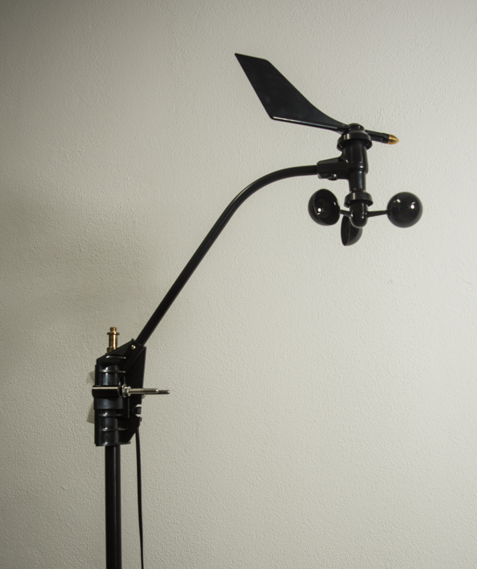

## 6. IL PROTOTIPO REALIZZATO

Il prototipo di laboratorio dell’Edge Gateway consiste di tre componenti:

* l’Edge Gateway
* la stazione meteo/ambientale
* la stazione di misura energetica

L’Edge Gateway a sua volta è formato da:

* scheda Raspberry Pi 3-B;
* sensore di temperatura/umidità I2C di test collegato direttamente;
* microSD da 16G classe 10 contenente
* Sistema Operativo Arch Linux per Raspberry Pi con le seguenti
  personalizzazioni per l’Edge Gateway TDM:
	* modalità *Access Point* che crea una WiFi Lan per la prima configurazione
	  e la connessione delle stazioni di misura;
	* applicativi di gestione dei container Docker e dei repository Git
	  preinstallati;
	* script per l’avvio automatico dei container;
* codice demo dei microservizi:
	* dispatcher (EDGE_dispatcher) per l’invio dei dati raccolti verso il
	  cloud;
	* handler meteo (FEINSTAUB_publisher) per l’interfacciamento con le
	  stazioni meteo/qualità dell’aria;
	* handler energia (IOTAWATT_publisher) per l’interfacciamento con le
	  stazioni di misura energetica;
	* handler di test per il sensore cablato HTU21D (HTU21D_publisher) per
	  misure di temperatura e umidità;
	* container per il database locale InfluxDB;
	* container per la visualizzazione locale dei dati Grafana;
	* container del broker locale per i messaggi MQTT degli handler Mosquitto.

Il prototipo è stato integrato con i seguenti sistemi di misura, i quali sono
stati interfacciati, valutati e testati. In alcuni casi, come per la stazione
meteo/ambientale, è stato modificato parte del firmware per integrare ulteriori
funzionalità:

* stazione di monitoraggio energetica IotaWatt, con 5 sonde di corrente e una
  di tensione collegata a quadro di alimentazione generale e impianto HVAC;
* stazione meteo/ambientale Stuttgart Fine Dust Sensor (codice Feinstaub) con:
	* anemometro e segnavento Argent System;
	* anemometro e segnavento Davis;
	* misuratore direzione vento Argent System;
	* pluviometro a vasca basculante Argent System;
	* anemometro Davis;
	* misuratore direzione vento Davis;
	* pluviometro a infrarosso Hydreon RG11;
	* sensore temperatura e umidità DHT22;
	* sensore di particolato PM10 e PM 2.5 Nova Fitness SDS11.

Edge Gateway con il sensore di prova HTU21D                           | 
--------------------------------------------------------------------- | 
 |

La stazione meteo/ambientale col sensore di particolato e T/H                                     |
------------------------------------------------------------------------------------------------- |
 |

Sensori vento e pioggia Argent System                              |
------------------------------------------------------------------ |
 |

Anemomentro e Segnavento Davis                      |
--------------------------------------------------- |
  |

La stazione di monitoraggio elettrico IotaWatt installata                              |
-------------------------------------------------------------------------------------- |
 |

Testing in laboratorio della soluzione standalone Edge Gateway – Stazione Meteo                              |
------------------------------------------------------------------------------------------------------------ |
 |

