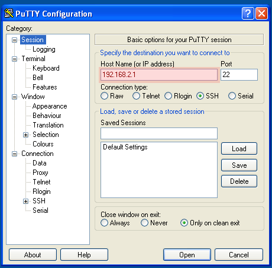

# Connessione all'Edge Gateway


1. [Recuperare l'indirizzo IP dell'Edge Gateway](#recuperare-lindirizzo-ip-delledge-gateway)
2. [Collegarsi all'Edge Gateway con SSH](#collegarsi-alledge-gateway-con-ssh)
3. [Collegarsi all'Edge Gateway con PuTTY](#collegarsi-alledge-gateway-con-putty)

## Recuperare l'indirizzo IP dell'Edge Gateway

Qualora fosse necessario recuperare l'*indirizzo IP* dell'Edge Gateway è possibile farlo attraverso il servizio *mDNS/DNS-SD/Bonjour*.

### Con Linux
Dalla console Linux di un PC/Laptop collegata alla stessa rete WiFi dell'Edge Gateway, col comando
```bash
avahi-browse -art
```
cercare le righe simili alle seguenti
```
=  wlan0 IPv4 tdm-edge-xxxxxxxx                             Web Site             local
   hostname = [tdm-edge-xxxxxxxx.local]
   address = [aaa.bbb.ccc.ddd]
   port = [80]
   txt = ["Service=\"Grafana\"" "Description=\"TDM Edge Gateway Web Dashboard\""]
```
l'indirizzo cercato è il valore del campo *address*.

### Con MacOS
Dalla console di MacOS di un Computer/Laptop collegata alla stessa rete WiFi dell'Edge Gateway, col comando
```bash
dns-sd -B
```
è possibile recuperare l'hostname dell'Edge Gateway:
```
Browsing for _http._tcp
DATE: ---Mon 09 Nov 2020---
20:26:20.434  ...STARTING...
Timestamp     A/R    Flags  if Domain               Service Type         Instance Name
20:26:20.435  Add        3   4 local.               _http._tcp.          tdm-edge-xxxxxxxx
```
mentre col comando (aggiungere *.local* all'hostname nel comando)
```
dns-sb -G v4 tdm-edge-xxxxxxxx.local
DATE: ---Mon 09 Nov 2020---
20:26:15.508  ...STARTING...
Timestamp     A/R    Flags if Hostname                               Address                                      TTL
20:26:15.509  Add 40000002  4 tdm-edge-xxxxxxxx.local.               aaa.bbb.ccc.ddd                              120
```
si ottiene l'indirizzo IP.

### Con Windows
Se su Windows è disponile il servizio Bonjour/mDNS, la procedura è la stessa che per Mac/OS.

### Dal router WiFi
E' possibile inoltre recuperare l'indirizzo IP dal proprio modem/router WiFi.
In questo caso accedere all'interfaccio di configurazione del modem e nella
schermata che elenca i dispositivi connessi cercare l'indirizzo associato
all'hostname dell'Edge Gateway.

## Collegarsi all'Edge Gateway con SSH
E' possibile utilizzare il programma *ssh* (Linux/MacOS) per accedere all'Edge Gateway usando:

  * l'indirizzo IP salvato durante la configurazione della rete WiFi domestica
    ```bash
    ssh alarm@www.xxx.yyy.zzz
    ```
  * il nome dell'host: **tdm-edge-xxxxxxxx**, es:
    ```bash
    ssh alarm@tdm-edge-xxxxxxxx
    ```
  * il nome dell'host: **tdm-edge-xxxxxxxx.local**, es:
    ```bash
    ssh alarm@tdm-edge-xxxxxxxx.local
    ```

## Collegarsi all'Edge Gateway con PuTTY

Per collegarsi all'Edge Gateway col programma PuTTY, impostare i seguenti parametri:




