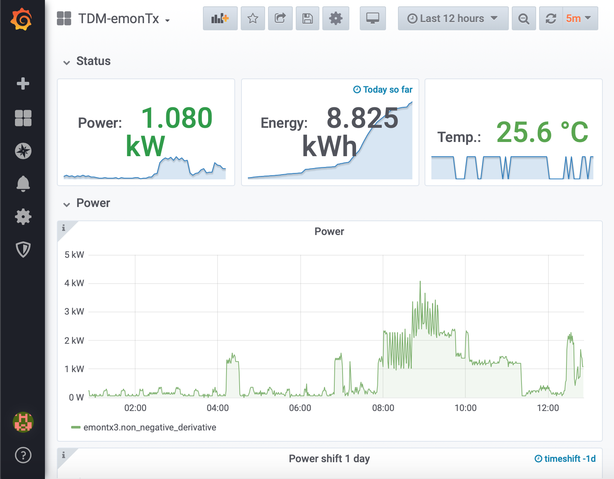

# Dashboard EmonTx

Accedendo all'indirizzo dell'edge nella LAN viene presentata una schermata di login per Grafana, il sistma utilizzato per la visualizzazione delle proprie misurazioni conservate nel database dell'Edge. Le credenziali standard sono **admin, admin**, ma se ne consiglia la modifica per evidenti esigenze di sicurezza. 

## Definizione delle sorgenti di dati

Effettuato l'accesso Grafana prevede come primo passo la definizione delle sorgenti dei dati da visualizzare. Queste sorgenti sono preconfigurate come mostrato in figura seguente.

Si tratta delle sorgenti di dati:
- Meteo, associata al database *luftdaten*,
- IotaWatt associata al database: *iotawatt*, 
- EmonTX associata al database *Emon*, 
- EdgeGateway associata al database *edgedevicehandler*.

Tra questa sorgenti IotaWatt è associata al sistema di misurazione avanzato, ed EmonTX è associato al sistema di misurazione base. Ci concentreremo su quest'ultimo.

## Definizione di una dashboard

Il secondo passo consiste nella definizione di una visualizzazione. Questa può essere definita totalmente dall'utente utilizzando componenti standard, ma per facilitare l'utilizzo da un utente non esperto sono state predisposte dei cruscotti standard liberamente distribuiti nella repository di Grafana.

Le visualizzazioni sono gestite attraverso il menu Dashboards-Manage come mostrato in figura seguente

Tramite il pulsante **Import** mostrato in figura è possibile una dashboard preconfigurata dall'[archivio pubblico di Grafana](https://grafana.com/grafana/dashboards). Ad ogni dashboard è associato un numero identificativo che basterà inserire nel campo apposito, ed in seguito premere il pulsante **Load**. Nel caso mostrato nella figura seguente viene importata la dashboard **11717** che costituisce il riferimento per il sistema di monitoraggio base, e che verrà presentata in maggiore dettaglio nella prossima sezione. 

Per completare l'importazione della dashboard occorre associare la sorgente di dati corretta tra quelle disponibili. La data source corretta è quella denominata EmonTX che deve essere selezionata come mostrato nella figura seguente.

La dashboard è a questo punto totalmente configurata, e mostra i dati conservati nel database locale. Il risultato sarà simile a quello mostrato nella figura seguente, una volta che dati a sufficienza saranno presenti nel database.

## Interfaccia utente ed esempio di fruizione

Esamineremo brevemente alcuni elementi dell'interfaccia standard per la consultazione dei dati di consumo energetico e di temperatura ambientale, fruibile attraverso l'edge device.

Una volta completato l'accesso all'edge attraverso l'interfaccia web di Grafana, viene presentata la visualizzazione della figura seguente che mostra lo stato attuale della potenza assorbita dall'impianto nell'ultimo intervallo temporale, l'energia consumata a partire dalla mezzanotte, e la temperatura attuale rilevata dalla sonda. 

Le visualizzazione sono raggruppate in gruppi di pannelli per una più agevole visualizzazione, denominati *Status, Power, Energy e Temperature* in relazione alle variabili mostrate.

Nel gruppo denominato Status sono mostrati tre pannelli con il valore più recente, come detto, sovrapposto ad un grafico che mostra la variazione della quantità nell'ultimo periodo.

Dal menu nell'estremità superiore destra dell'interfaccia è possibile settare il periodo esaminato (le ultime 12 ore in questo caso) che può essere specificato attraverso il menu a discesa. Sono presenti diversi valori preimpostati ma è chiaramente possibile fissare un intervallo desiderato diverso, l'intera visualizzazione verrà aggiornata di conseguenza. L'ultimo pulsante a destra permette di fissare l'intervallo di refresh della visualizzazione (in questo caso 5 min) ed è disponibile un pulsante che permette di forzare l'aggiornamento alla sua pressione.

Il gruppo di pannelli *Power* mostrato nella figura seguente mostra i grafici relativi alla potenza media assorbita nel tempo, confrontata con l'andamento rilevato il giorno precedente.

I grafici sono interattivi, ad esempio sono disponibili le normali operazioni di pan e zoom ed il movimento del cursore mostra il valore della serie temporale ad ogni istante.

A titolo di esempio la figura seguente mostra l'interfaccia per la definizione della query utilizzata per la lettura dei dati dal database Influx. L'interfaccia permette una interrogazione quidata, attraverso la selezione del database di interesse (*FROM:*), l'indicazione dalla variabile da selezionare e delle operazioni da compiere su di essa (*SELECT:*), e la definizione dell'intervallo temporale su cui fare l'aggregazione e la modalità di trattamento per i dati mancanti (*GROUPBY*). Ulteriori campi permettono di definire shift temporali, inoltre sono disponibili numerose operazioni predefinite con operazioni di trattamento dati comuni.

Nel caso mostrato nella figura seguente viene selezionata la misurazione *pulse* dal database *emontx3*, che contiene i dati relativi alla serie temporale dei conteggi dei consumi elettrici rilevati tramite i pulse del meter. I dati sono raggruppati in intervalli di *1 min* e per ogni intervallo si considera il valore minimo *min()*, ossia il valore ad inizio intervallo essendo il conteggio dei consumi sempre crescente. Infine viene calcolata la derivata su un intervallo di tempo di 1 h, filtrando eventuali valori negativi (*non\_negative\_derivative(1h)*) per calcolare il consumo in kWh e filtrare gli istanti in cui il contatore intero degli impulsi si azzera per raggiungimento del limite superiore.

Come detto è possibile effettuare elaborazioni più complesse rispetto a quella mostrata. 

Altre schede di configurazione del pannello permettono di definire l'aspetto del grafico, e di definire condizioni per le quali vengano attivati degli Alert (si pensi al banale superamento di una soglia di consumo).

La figura seguente mostra i due pannelli utilizzati per la visualizzazione dei consumi energetici recenti, contenenti rispettivamente l'energia complessivamente misurata nelle ultime 24 h  e negli ultimi 7 giorni. I grafici permettono di apprezzare le due tipiche periodicità dei consumi: giornaliera e settimanale. Le elaborazioni dei dati permetteranno di evidenziare scostamenti dai comportamenti medi ed eventuali trend.

La figura seguente mostra invece le visualizzazioni standard per l'andamento della temperatura rilevata nelle ultime due settimane di dati. Si è scelto un intervallo di variazione più ampio per permettere di apprezzare le variazioni di lungo periodo dovute ai cambiamenti stagionali. Nella figura è anche evidente un salto nella misura dovuto ad un riposizionamento della sonda, un effetto di cui occorrerà tenere conto nella elaborazione dei dati. Dal primo plot oltre al chiaro trend di crescita si può apprezzare anche la periodicità giornaliera delle rilevazioni, con un incremento progressivo durante il giorno ed una diminuzione della temperatura durante la notte. L'istogramma del secondo pannello mostra la bassa variabilità delle misure.

