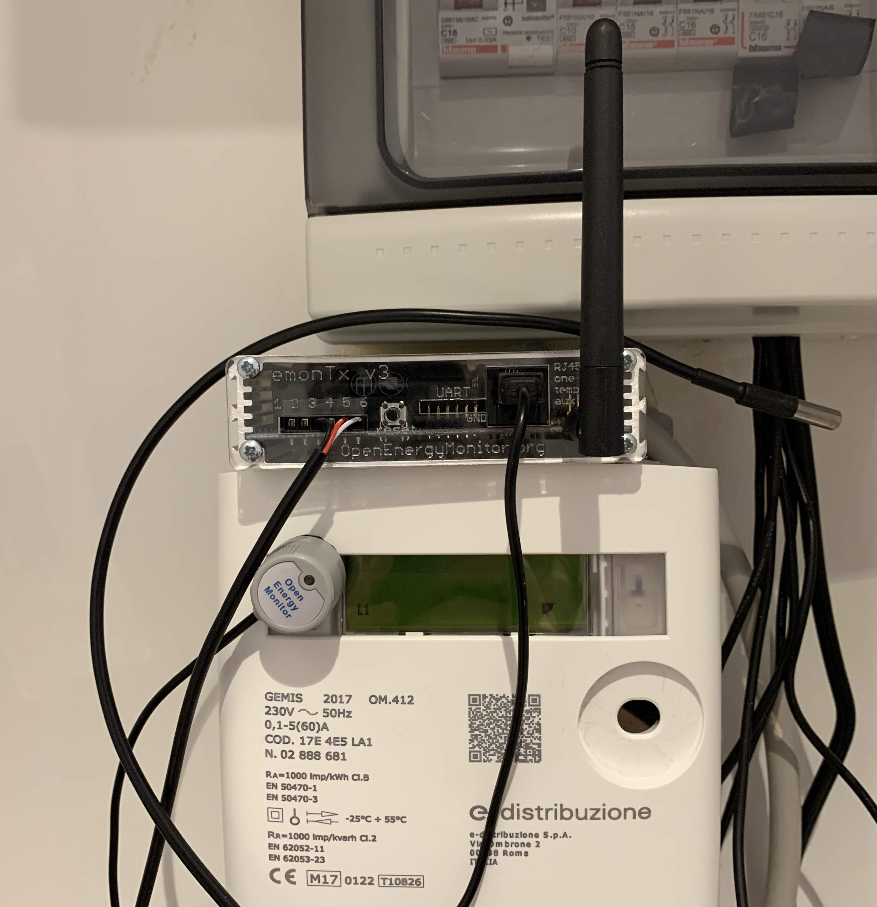

# Configurazione del sensore emonTx

Il sistema EmonTx permette il monitoriaggio dei propri consumi elettrici attraverso il conteggio degli impulsi ottici del comune contatore elettrico domestico, non richiede pertanto l'apertura del quadro elettrico e la manipolazione dei cavi, non necessita di configurazioni complesse per il conferimento delle misurazioni al database dell'Edge, ed è alimentato tramite pile stilo, pertanto non richiede l'installazione di prese dedicate.

I sensori dell'EmonTx sono rappresentati da una fotocellula per il conteggio dei pulse e da una sonda per la misurazione della temperatura ambientale.

La figura seguente mostra l'installazione del dispositivo su un normale contatore domestico.

## Procedura passo passo

Per l'installazione sarà necessario l'utilizzo di un cacciavite a stella di medie dimensioni e di un cacciavite a taglio di piccole dimensioni per applicazioni elettroniche, o di un cercafase ma di dimensioni molto piccole.

### 1. Aprire l'emonTx

1. Smontare il pannello trasparente dal lato del connettore dell'antenna (e' il lato con l'apertura stretta con scritto sopra 123456) rimuovendo (e conservando) le 4 viti con il cacciavite a stella.
2. Sfilare la scheda elettronica all'interno, prendere nota della posizione di installazione della scheda all'interno del case in alluminio, la scheda andrà rimontata nella stessa sede.

### 2. Installare la sonda di temperatura

La sonda va collegata alla morsettiera coi pin numerati da 1 a 6, come mostrato nella figura seguente.

1. Passare il cavo della sonda attraverso il foro del pannello esterno
   corrispondenza della morsettiera, è la feritoia con l'indicazione 123456 relativa ai morsetti; tenere conto di quale sia il lato esterno del pannello in plastica, il lato stampato deve essere posizionato all'esterno e deve essere possibile riavvitare il pannello al contenitore in alluminio.
2. Allentare le viti corrispondenti alle posizioni 3, 5 e 6 della morsettiera;
3. Collegare i cavi rosso, bianco e nero della sonda alla morsettiera come visibile nella figura precedente e come specificato nella
   seguente tabella:

Morsetto  | Sonda
--------- | ---------------
3 (GND) 	| Nero (GND)
5 (Dig19) | Rosso (Power)
6 (Dig5) 	| Bianco (Data)

4. stringere le viti 3, 5 e 6 della morsettiera e assicurarsi che la sonda sia ben collegata ed i fili non escano dai morsetti; se così non fosse ripetere l'operazione a partire dal punto 2.

### 3. Installare pile

Inserire le pile stilo nell'apposita sede sulla scheda. Verificare la correttezza dell'installazione, la molla va sul polo negativo della stilo, quello piatto.

### 4. Chiudere l'emonTx

Infilare la scheda nella sua sede, collocare il coperchio e fissare con le viti, evitando di stringere troppo. Le viti potrebbero essere un po' dure da stringere.

### 5. Installare l'antenna

L'antenna di trasmissione va avvitata all'apposito connettore filettato, posto sullo stesso lato del connettore della sonda di temperatura.

### 6. Collegare la fotocellula

La fotocellula si collega alla porta RJ-45.

### 7. Collocare in sede

A questo punto, l'emonTx è pronto per monitorare il flusso di energia
misurato dal contatore.  Monitoreremo i consumi attraverso le pulsazioni
della luce indicatrice del contatore.

**La luce da monitorare è tipicalmente quella in alto alla sinistra del display;** lampeggia di rosso.  Oggi pulso di questa luce indica il consumo di 1 Wh di
energia.

1. Attaccare il cerchio in velcro autoadesivo al contatore sopra la lucina da
   monitorare, assicurandosi che la lucina sia visibile attraverso il foto
  centrale.
2. Installare la fotocellula collegata all'emonTx sul velcro.

L'emonTx andrà poggiato da qualche parte -- e.g., sul contatore, o in fondo
all'armadietto, oppure fissato con del velcro in modo che possa essere
facilmente estratto per sostituire le pile.

### 8. Finito!

## Guida dettagliata

Guide dettagliate all'emonTx sono disponibili da openenergymonitor.org:
* <https://wiki.openenergymonitor.org/index.php/EmonTx_V3.4>;
* <https://guide.openenergymonitor.org/technical/emontx/>.
