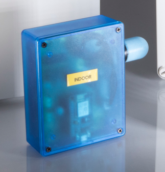
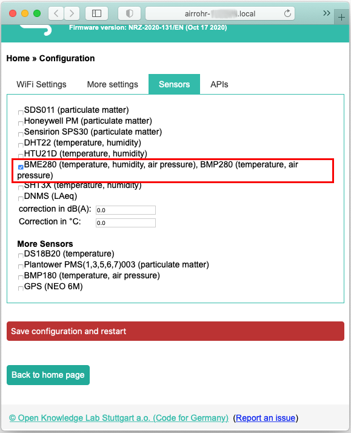
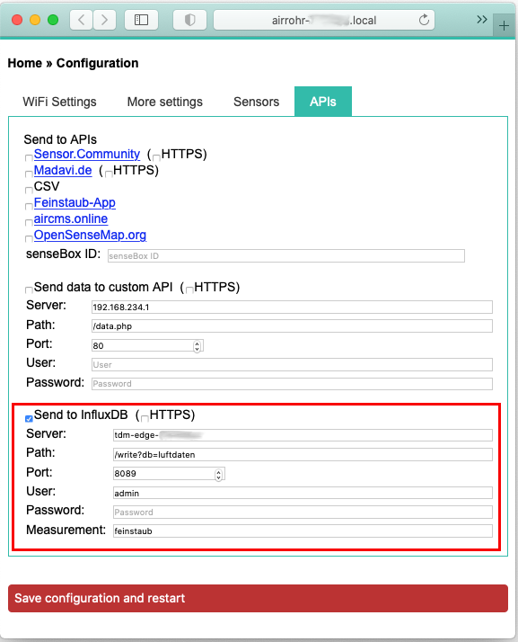

# Configurazione della stazione indoor TDM

La stazione meteo/climatica Indoor TDM consiste in un sensore di tipo
"[airRohr](https://sensor.community/it/sensors/airrohr/)" pre-assemblato per
cui per i dettagli circa l'installazione e la configurazione si rimanda alla
relativa pagina di progetto.

0. [Installazione firmware](#installazione-firmware)
1. [Configurazione della stazione indoor TDM](#configurazione-della-stazione-indoor-tdm)
2. [Parametri per la configurazione con l'Edge Gateway TDM](#parametri-per-la-configurazione-con-ledge-gateway-tdm)

## Installazione firmware
Per l'installazione firmare fare riferimento alla sezione "[Driver e
Firmware](https://sensor.community/it/sensors/airrohr#Driver_e_Firmware)".  I
passi necessari per l'installazione del firmware, qualora non fosse già
presente sono:

* installazione sul PC del driver per NodeMCU (la scheda madre della stazione);
* installazione del software [airRohr Flashing Tool](http://firmware.sensor.community/airrohr/flashing-tool/)
  per la programmazione della scheda;
* installazione, attraverso il l'airRohr Flashing Tool del *firmware* sulla
  scheda.

## Configurazione della stazione indoor TDM
Per la configurazione fare riferimento alla sezione
"[Configurazione](https://sensor.community/it/sensors/airrohr#Configurazione)"
della pagina del sensoore "airRohr".

I passi necessari sono:
* accendere la stazione collegandola all'alimentazione;
* dal PC cercare la sua rete wireless "**airRohr-XXYYZZ**";
* da browser web accedere all'indirizzo "**http://192.168.4.1/**";
* configurare la stazione.
	
## Parametri per la configurazione con l'Edge Gateway TDM

### Configurazione dei sensori

Per acquisire i dati meteo/climatici e trasmetterli all'Edge Gateway occorre
selezionare i sensori presenti nella stazione.
* Dal menu "*Configurations*" della stazione (attraverso l'interfaccia Web)
  andre sul tab "*Sensors*"
  * selezionare il sensore "**BME280 (temperature, humidity, air pressure),
    BMP280 (temperature, air pressure)**"
* procedere col le altre configurazioni o cliccare su "*Save configuration and
  restart*" per salvare le impostazioni e renderle effettive.

### Configurazione delle API

Per trasmettere i dati all'Edge Gateway TDM occorre configurare le API.
* Dal menu "*Configurations*" andare sul tab "*APIs*"
  * deselezionare tutte le API (a meno che non si vogliano trasmettere i dati
    rilevati anche ad altri servizi)
  * selezionare "**Send to InfluxDB**"
  * nel campo "*Server*" inserire **l'hostname** dell'Edge Gateway o il suo
    **indirizzo IP**
  * nel campo "*Path*" inserire la stringa "**/write?db=luftdaten**"
  * nel campo "*Port*" il valore "**8089**"
  * nel campo "*Measurement*" il valore "**feinstaub**"
* procedere col le altre configurazioni o cliccare su "*Save configuration and
  restart*" per salvare le impostazioni e renderle effettive.

