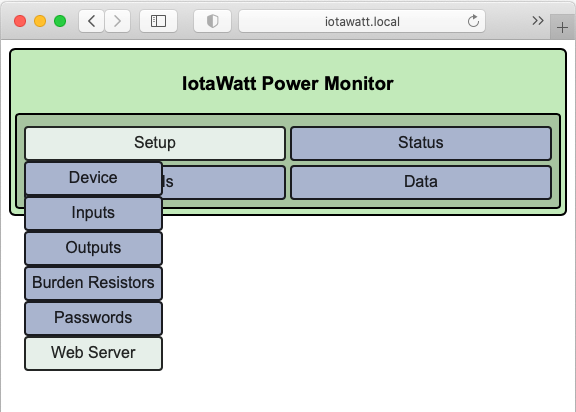
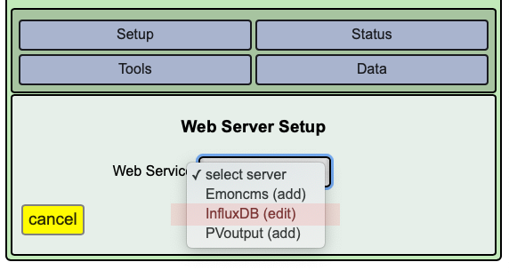
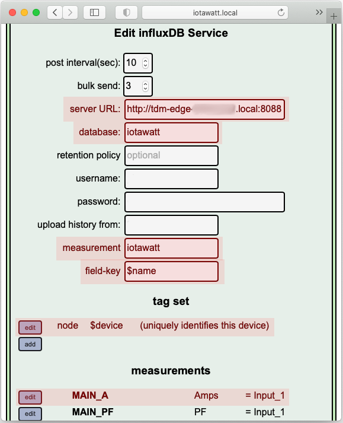

# Configurazione della stazione IoTaWatt

La stazione di rilevazione dei parametri di consumo elettrico o *IoTaWatt* una
estesa documentazioni raggiungibile alla pagina
"[IoTaWatt documentation](https://docs.iotawatt.com/en/master/). Si rimanda ad
essa per la dicumentazione e le istruzioni di configurazione.  Di seguito sono
forniti i dettagli per la condfigurazione dei parametri utili alla trasmissione
dei dati sull'Edge Gateway TDM.

1. [Parametri per la configurazione con l'Edge Gateway TDM](#parametri-per-la-configurazione-con-ledge-gateway-tdm)
2. [Convenzione per i nomi delle misure](#convenzione-per-i-nomi-delle-misure)

## Parametri per la configurazione con l'Edge Gateway TDM

Per configurare la IoTaWatt affinché trasmetta le misure rilevate dai sensori all'Edge Gateway:
* accedere tramite browser all'interfaccia di configurazione dell'IoTaWatt
  * o all'indirizzo **http://iotawatt.local** se sul PC è disponibile il servizio DNS-SD/mDNS/Bonjour
  * o all'indirizzo IP assegnato durante la configurazione iniziale (vedere [IoTaWatt - Device Configuration](https://docs.iotawatt.com/en/master/devConfig.html))
* portare il mouse sul bottone "*Setup*" e premere sul bottone "*Web Server*" quando compare

* cliccare su "*select server*" nel box "*Web Service*" e selezionare
  "*InfluxDB*" dal menu a tendina

* nel form che appare:
  * nel campo "*server URL*" inserire **l'hostname** dell'Edge Gateway o il suo **indirizzo ip** preceduto da "**http://**" e seguito da "**:8088**"
    * es **http://tdm-edge-xxxxxxxx.local:8088**
  * nel campo "*database*" inserire il valore "**iotawatt**"
  * nel campo "*measurement*" inserire il valore "**iotawatt**"
  * nel campo "*field-key*" inserire il valore "**$name**" (non dimenticare il carattere dollaro '**$**')

* aggiungere un "*tag set*" con valori:
  * "*tag key*": "**node**"
  * "*tag value*": "**$device**" (non dimenticare il carattere dollaro '**$**')

* configurare le *misure* da inviare.

## Convenzione per i nomi delle misure

### Nomenclatura 

Per i nomi delle misure si segue il seguente formato:  `TYPE[-N][-P]_UNIT`

| Simbolo | Obbligatorio? | Definizione                                                                                                         |
| ------- | ---------     | -----------                                                                                                         |
| TYPE    | si            | uno dei nomi definiti nelle tabelle seguenti                                                                        |
| N       | no            | un numero da indicare nel caso siano presenti più istanze dello stesso tipo (ad esempio `LIGHTS-1_W`, `LIGHTS-2_W`) |
| P       | no            | **solo per impianti trifase** è una delle lettere 'A', 'B', 'C', 'N' ad indicare le fasi A, B, e C ed il neutro     |
| UNIT    | si            | P per *Potenza* oppure V per *Volt*                                                                                 |

### Unità di misura

Per la linea di tensione si comunicano i volt. **Per tutte le misure di carico e
generazione, la convenzione è di comunicare la potenza e quindi i watt**.

La corrispondenza tra lettera usata nel nome l'unità da selezionare nella
configurazione dello IoTaWatt è nella seguente tabella.

| Lettera | Misura   | Unità IoTaWatt |
| ---     | ---      | ---            |
| P       | Potenza  | W              |
| V       | Tensione | V              |

### Polarità delle potenze

* Positive in caso di assorbimento;
* negative in caso di generazione/immissione in rete.

### Linee di alimentazione

| Nome   | Descrizione                                                                                                                        | Esempio    |
| ----   | -----------                                                                                                                        | -------    |
| LINE   | Scambio netto con la rete elettrica; **positivo in assorbimento**, **negativo in caso di immissione** di eccedenze da generazione. | `LINE_W`   |
| LOAD   | Assorbimento totale da tutti i carichi                                                                                             | `LOAD_W`   |
| LINE-A | Fase 1 - per impianti trifase                                                                                                      | `LINE-A_P` |
| LINE-B | Fase 2 - per impianti trifase                                                                                                      | `LINE-B_P` |
| LINE-C | Fase 3 - per impianti trifase                                                                                                      | `LINE-C_P` |
| LINE-N | Neutro - per impianti trifase                                                                                                      | `LINE-N_P` |
| V      | Tensione                                                                                                                           | `V_V`      |

### Linee di generazione

Per i generatori, riportare valori negativi quando sta generando; positivi quando sta consumando.

| Nome | Descrizione             | Esempio |
| ---- | -----------             | ---     |
| PV   | Generatore fotovoltaico | `PV_W`  |
| WT   | Generatore eolico       | `WT_W`  |

### Linee di carichi vari

Coi carichi si chiede di configurare tutti nomi applicabili all'impianto.
Potremmo quindi avere configurazioni dove alla stessa pinza corrispondono più
misure (e.g., `KITCHEN`, `FRIDGE`, `DISH`, `OVEN` ecc.)

| Nome    | Descrizione                                           | Esempio    |
| ----    | -----------                                           | ---        |
| BATH    | Bagno                                                 | `BATH-1_W` |
| CAR     | Ricarica automobile                                   |            |
| DISH    | Lavastoviglie                                         | `DISH_W`   |
| DRYER   | Asciugatrice                                          |            |
| FRIDGE  | Frigorifero                                           |            |
| HVAC    | Climatizzazione, ventilazione (e.g., pompe di calore) |            |
| KITCHEN | Cucina - Forno, fornelli elettrici, ecc.              |            |
| LAUNDRY | Bucato - Lavatrice, asciugatrice                      |            |
| LIGHTS  | Luci                                                  |            |
| LIVING  | Soggiorno                                             |            |
| OFFICE  | Ufficio                                               |            |
| OUTDOOR | Giardino, spazio esterno                              |            |
| OVEN    | Forno                                                 |            |
| PRINT   | Stampanti                                             |            |
| PUMP    | Autoclave                                             |            |
| ROOM    | Stanza                                                |            |
| TVE     | TV e home entertainment                               |            |
| WASH    | Lavatrice                                             |            |
| WATER   | Riscaldamento acqua calda sanitaria                   |            |
